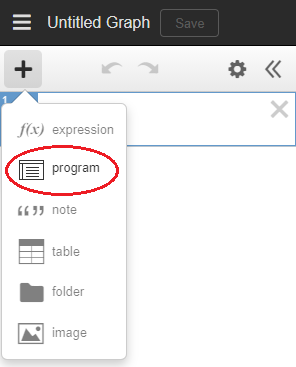

# DesmosPlayer
Program the action in your Desmos graph to create animations for videos, presentations, etc.


## Introduction
When I started making short math videos using Desmos for the visuals, I would write down the sequence of actions I needed to perform on the expressions while doing a screen capture.  For example:  1) Unhide first expression; 2) Start slider for variable A; 3) Hide first expression and show second expression; and so on.  As my videos got longer and more involved, this became quite tedious.  I needed a way to program those actions so it would just happen automatically.  That is what DesmosPlayer will do.  You create a list of these actions, including pauses to get the timing right, and then click a button to start it running.

## Installation
Install the file desmosPlayer.user.js in your browser using your favorite script manager and make sure the installed script is enabled.  Typically (e.g. with Tampermonkey installed) this is done by clicking on the file name above, then clicking "Raw" and then "Install".  Then navigate to any Desmos calculator graph.

To install Tampermonkey on Chrome (free and recommended), go to https://chrome.google.com/webstore/detail/tampermonkey/dhdgffkkebhmkfjojejmpbldmpobfkfo and click the "install"
 button. Look for the Tampermonkey icon to the right of the URL bar at the top of the Chrome window, click it, and make sure the drop-down menu indicates that it is enabled.

## Usage
When desmosPlayer is installed, a new kind of expression, a "program", is added to the "+" menu.  A program is a container for text, much like a "note".  It contains javascript code that you write which defines an array of instructions to control elements of your graph. When your javascript code is executed, the array of instructions is loaded into the desmosPlayer system.



When a program is added to the expression list, it contains a sample program to get you started with the proper syntax and format.  You will replace this code with your own definitions and instruction array(s).  To the left of the text is a circular icon which you will click to execute the program code.  If the code runs successfully, the icon turns green, meaning your instructions have been loaded. Buttons will appear above the graph next to the "Save" button which let you control the execution of these instructions.  If there is an error, the icon will turn red, and you can check the console for an error message, edit the program and try again.


## Examples / Demos
To quickly give this a try, install desmosPlayer in your browser and then visit these graphs. Each one has a program.  Click the circular icon next to it, and then click the "Start" button that appears next to the "Save" button.

Graph Link | What It Is
--- | ---
<a target="_blank" href="https://www.desmos.com/calculator/rnzfxhdzqu">MathyJaphy</a> | Animation of my YouTube channel logo, used in <a target="_blank" href="https://youtu.be/sV1NbgNodD0">this video</a>.
<a target="_blank" href="https://www.desmos.com/calculator/hslbl39gnw">Binary Counter</a> | A demonstration of how one might use labels and goto instructions.
<a target="_blank" href="">Ptolemy's Theorem</a> | The graph used to make <a target="_blank" href="">this video</a>.

## Disclaimers

Tested only on Chrome and Safari.  May have issues on other browsers.

Due to the risk of running malicious code in an unknown graph, you should always inspect the code before running it by clicking the program icon.

This is my first forray into JavaScript and GitHub, so please be kind if there are bugs or non-conformant stylings.  😬

## Documentation

### Overview

This system allows you to write a simple piece of JavaScript code that defines a program, a sequence of actions to perform on a Desmos graph.  The main element of that code is a call to the function `desmosPlayer()`.

#### desmosPlayer (\<program\>, [\{\<properties\>\}])

Parameter | Description
---- | ----
\<program\> | An array of instructions that modify expressions in a Desmos graph.
\<properties\> | (optional) An object that conveys additional configuration parameters.

This is the main function of the DesmosPlayer module.  It loads the given program and creates additional buttons in the UI for running it.
You create a program by filling an array with the results of "instruction functions" (see examples below), then pass this program
to `desmosPlayer()`, along with optional properties:

     debugMode:  Set to 'true' to enable back-stepping.

### The Program

The instructions in a program array are function calls.  Most of these functions take an `<id>` parameter
to indicate which expression(s) in the graph to operate on.  Each expression in a Desmos graph has a unique ID which is a string.
It is normally a numeric string, and so numeric syntax can be used instead of string syntax.  The ID
could be a non-numeric string if the expression is created by your program (see the `set()` instruction function below).

> :warning: Note: The ID is not the same as the index of the expression.

> :bulb: Tip: To find the ID of an expression, click on the expression while holding down the Ctrl key (Windows) or the Command key (Mac).  The ID is printed in the console and copied to the clipboard so you can easily paste it into your program.  See the section on Usability Features below for more details.

Here is an example of a program script that you would write:

```javascript
// Helpful symbolic names for expression ID's
const xPos = 139
const yPos = 140
const label = 141
const labelAngle = 144
const labelSize = 145
const val1 = 775
const val2 = 776

// Define the program
const exampleProgram = [
    show(label, 1000),
    startSlider(xPos, 1000),
    startSlider(yPos, 1000),
    startSlider(val1),
    animateValue(val2, 0, 1.5, 0.1, 0, 3000),
    stopSlider(val1),
    [startSlider(labelAngle),
     startSlider(labelSize)],
    pause(2500),
    hide(label)
]

// Load it
desmosPlayer(exampleProgram, {debugMode: true});
```

Note that you can have more than one program in your graph.  Only one can be loaded at a time.

### Buttons

When you are ready to run your program, click the circular program icon to the left of the program text.  If all goes well, it will turn green to indicate that the program is loaded, and the "Start", "Reset", "Step" and (optionally) "Back Step" buttons will appear.  The "Reset" and "Back Step" buttons are disabled until you have run at least one instruction.  If there is an error, which may occur immediately or after executing and instruction with an invalid ID, that icon will turn red.  When this happens, you can open the console to find the error message.  In some cases, you can easily find the problem.  But sometimes it is tricky. It helps to be familiar with the developer tools in your browser. If it is not clear what the problem is, check for common syntax mistakes like forgetting to put a comma between instruction functions.  When you change the program text the program icon will return to its uncolored state to indicate that the program has changed since it was loaded, and can be loaded again.

When desmosPlayer has been called and a program is loaded and ready to run, a "Start" button will be added next to the "Save" button. Clicking it will start the program and turn it into a "Stop" button.  Clicking it again will stop execution of the program.  A "Reset" button will also appear. When clicked, it will reset the program so that it starts over from the beginning.

> :bulb: Tip: The "Reset" button will not reset the graph itself to its initial state. The original version of desmosPlayer did this, but changes made to the graph after running the program were overwritten by the saved graph state. Instead, you now need to start your program with instructions that reset all graph elements that your program changes. See the section on Usability Features for more details on this recommendation.

There is also a "Step" button which will execute one function in the program at a time.  If `debugMode` is true, then a "Back Step" button also appears after the program has started, allowing you to undo the effect of the previous step, all the way back to the start of the program. This is implemented by saving the entire graph state after every instruction is executed, and restoring the previous state when the button is clicked.  This is expensive and may introduce a tiny bit of lag (though I have yet to observe this).  When you are done creating and debugging your program, consider setting `debugMode` to `false`.

> :bulb: Tip: The "Back Step" button will erase any changes you've made to the graph since the previous instruction was executed. To help prevent accidental loss of graph changes, the "Back Step" button will turn red if the system recognizes that you've made changes that would be lost if you click it.  Clicking the "Back Step" button will not overwrite changes that you have made to programs.  See the section on Usability Features for more details.

### Running the Program

When the "Start" button is pressed, execution of the instructions proceeds automatically from one to the next.
The `pause()` instruction can be used to insert delays.  Also, most
instructions take an optional delay value as the final parameter which
inserts an implicit `pause()` after the instruction has run.

Instructions can be grouped together using square brackets.  Instructions
in such groupings will be run without delays and without giving Desmos a
chance to update its graph until they have all run.  This can eliminate
glitches in the animation and make it look as though the instructions ran
simultaneously.  For example:

    const testProg = [
       startSlider(1, 5000),
       [setValue(1, 0),
        setValue(2, 1.0),
        setValue(3, 2.5),
        hideLabel(3),
        showLabel(4)],
       startSlider(1, 5000)
    ]

Without the grouping, intermediate states from setting individual values and showing or hiding
individual expressions might be visible as glitches.  Delays
within the grouped commands are ignored, and `animateValue()` instructions
will go directly to the ending value.  It is an error to have a `goto()`
instruction inside a grouping.

> :bulb: Tip: When each instruction is executed, a message is displayed in the console
so it is possible to see what the program is doing.  When back-stepping,
the console will show the instruction that was just undone.

> :bulb: Tip: You can skip through the program quickly by repeatedly clicking the "Step" button.  This can be helpful when debugging a section of the program that is not near the start. When single-stepping, pauses and delays are ignored.  Also, `animateValue()` instructions go straight to the final value and finish if the "Step" button is clicked again while they are running.

> :bulb: Tip: To jump directly to a section of the program that you want to debug, you can add labels and a `goto()` instruction at the start of the program. But without executing all prior instructions, the graph may not be in a useful state when it gets there.


### Usability Features

desmosPlayer has some convenience features to help with developing your program.

#### Finding an expression's ID

Every program needs to refer to expressions by their ID, which is not normally accessible. With desmosPlayer, you can get at an expression's ID by holding down the Ctrl key (Windows) or the Command key (Mac) while clicking on an expression.  The expression's index and ID will be displayed in the console, and the ID will be copied to the clipboard so that you can easily paste it into your program text.

#### Finding an expression from an ID in your program

While developing your program, you might want to know which graph expression corresponds to an ID that you have added to your program.  To find out, select the ID string in your program and click on the selected text while holding down the Ctrl key (Windows) or the Command key (Mac).  The corresponding expression will be selected and scrolled into view.  If your program is loaded, this also works when you select the symbolic name that you have defined for an expression ID!

#### Searching for text within your program

If your program has many lines, you might want some assistance finding text within it. Typically, you might want to find all the references to a particular ID or the symbolic name you defined for it.  Desmos's ctrl-F feature allows you to search within the expressions list, but it only shows you the expressions that contain the search string, not where the search string is within the expression.  So, desmosPlayer has a special mechanism for searching within a program for other occurrances of text that you have already found.  (If you don't see the text you want to search for, you'll need to type it into the program, perhaps within a comment so it doesn't cause an error before you get around to removing it).  Select the text you want to search for, then click on the selected text while holding down the Alt key (Windows) or Option key (Mac).  The next occurrance of that string will become the new selection and will scroll into view if necessary.  The search will wrap around if it reaches the end without finding it. To search backwards, also hold down the Ctrl key (Windows) or the Command key (Mac) (i.e. ctrl-alt-click or command-option-click).

#### Saving your work

Losing important changes by resetting the graph, or by back-stepping, or by reloading the graph in order to start from scratch, was a frustrating aspect of developing graphs and their programs in the first version of desmosPlayer.  This version has changes meant to reduce the chance that this will happen. 

To help you recognize when you have made changes to the graph that you might want to save, desmosPlayer will not enable the "Save" button for graph changes made by running your instructions.  In other words, if the "Save" button is enabled, there is a change that you made by hand which you should consider saving.  Of course, when you do use the "Save" button, the current state of the graph will be saved, whether it got there by your instructions running or by manual graph changes, or both.

The "Back Step" button restores a previously saved graph state, so it will overwrite any changes you have made by hand!  To help recognize when this could happen, the "Back Step" button will turn red when desmosPlayer thinks that clicking it would overwrite something you changed.  (Note that the text of your programs is not overwritten when back-stepping, so the button will not turn red for program changes.)  The red color is just a warning.  The changes you made may be insignificant and would not be missed if you click the button while it is red.

The "Reset" button does not restore the original state of the graph.  It only resets the program so that it runs from the beginning.  This makes the "Reset" button less destructive, but it means that you need a way to get the graph back into its initial state before you run after a reset. Note that restoring a saved version of the graph would also destroy changes you've made that you might want to save.  Therefore, it is recommended that you always start your program with instructions that reset any changes your program makes to graph elements.  Whenever you introduce a new expression ID to the program, take a moment to add an instruction that would reset any changes that you plan to make to that expression.  The initialization instructions can be in one or more separate program arrays to distinguish them from the main program.  The initialization arrays can be included at the start of your main program array so that they always execute after a reset (see the example graph for "Ptolemy's Theorem").  If you follow this recommendation, then you can save the graph whenever you make a change that you want to keep, no matter what state the graph is in when you save it.  Save early and often!

### Instruction Functions

    hide (<id>, [<id>, ...])
    show (<id>, [<id>, ...])
    hideLabel (<id>, [<id>, ...])
    showLabel (<id>, [<id>, ...])
    setLabel (<id>, <labelString>, [<delay>])
    setValue (<id>, <value>, [<delay>])
    setValue0 (<id>, [<id>, ...])
    startSlider (<id>, [<delay>])
    stopSlider (<id>, [<delay>])
    animateValue (<id>, <startVal>, <endVal>, <increment>, [<frameDelay>], [<delay>])
    setSliderProperties (<id>, {<properties>}, [<delay>])
    set (<id>, <properties>, [<delay>])
    stop (<messageString>)
    pause (<delay>)
    label (<labelNameString>)
    goto (<labelNameString>, [<repeatCount>])

--------------------------------------------------------------------------

**hide \(\<id\>, \[\<id\>, ...\]\)<br>
show \(\<id\>, \[\<id\>, ...\]\)<br>
hideLabel \(\<id\>, \[\<id\>, ...\]\)<br>
showLabel \(\<id\>, \[\<id\>, ...\]\)**
Parameter | Description
--- | ---
\<id\> | A comma-separated list of expression ID's

Hides or shows the expressions or labels of the expressions given as arguments to the instruction.
For `hide()` and `show()`, the ID can be for a folder as well as an individual expression.
These functions do not take an optional delay parameter like most others.

--------------------------------------------------------------------------

#### setLabel \(\<id\>, \<labelString\>\, [\<delay\>])
Parameter | Description
--- | ---
\<id\> | The ID of an expression with a label
\<labelString\> | The desired label string
\<delay\> | (optional) Number of milliseconds to delay before next instruction

Sets the label of the given expression to the given string.
If the string uses latex, enclose the latex in back-ticks as usual.

--------------------------------------------------------------------------

#### setValue \(\<id\>, \<value\>, \[\<delay\>\]\)
Parameter | Description
--- | ---
\<id\> | The ID of a "\<name\>=\<value\>" type of expression
\<value\> | Latex string or number of new value
\<delay\> | (optional) Number of milliseconds to delay before next instruction

Replaces the `<value>` part of the given expression with the given value.
The value can be any latex expression string or a number.  If the
expression has a slider that is playing, it will be stopped first.

--------------------------------------------------------------------------

#### setValue0 \(\<id\>, \[\<id\>, ...\]\)
Parameter | Description
--- | ---
\<id\> | A comma-separated list of expression ID's

Equivalent to calling `setValue(\<id\>, 0)` for each of the given expressions.
This is a useful shorthand for initialization instructions at the beginning
of a program.

--------------------------------------------------------------------------

#### startSlider \(\<id\>, \[\<delay\>\]\)
Parameter | Description
--- | ---
\<id\> | The ID of an expression that has a slider
\<delay\> | (optional) Number of milliseconds to delay before next instruction

Equivalent to pressing the play button on a slider when it is not yet running.

--------------------------------------------------------------------------

#### stopSlider \(\<id\>, \[\<delay\>\]\)
Parameter | Description
--- | ---
\<id\> | The ID of an expression that has a slider
\<delay\> | (optional) Number of milliseconds to delay before next instruction

Equivalent to pressing the pause button on a slider when it is already running.

--------------------------------------------------------------------------

#### animateValue \(\<id\>, \<startVal\>, \<endVal\>, \<increment\>, \[\<frameTime\>\], \[\<delay\>\]\)
Parameter | Description
--- | ---
\<id\> | The ID of a "\<name\>=\<value\>" type of expression
\<startVal\> | The starting value for the animation
\<endVal\> | The ending value for the animation
\<interval\> | The amount to step by on each frame
\<frameTime\> | (optional) Number of milliseconds of explicit delay between frames
\<delay\> | (optional) Number of milliseconds to wait after animation is done

Animates a variable by setting its value to `startVal` and incrementing or
decrementing it by the given `interval` until it reaches `endVal`.  Speed
can be controlled by changing the `interval` and by giving a `frameTime` value.
This is similar to playing a slider, but allows explicit control over the
speed and the step size, and allows running in reverse.  The instruction
blocks until the `endVal` is reached, unlike startSlider which moves on to
the next instruction after the slider starts.  If the expression has a
slider that is playing, it will be stopped first.

--------------------------------------------------------------------------

#### setSliderProperties \(\<id\>, \{\<properties\>\}, \[\<delay\>\]\)
Parameter | Description
--- | ---
\<id\> | The ID of an expression with a slider
\<properties\> | The properties to be set
\<delay\> | (optional) Number of milliseconds to wait before next instruction

Sets the given properties of the given slider. Only the properties that you want to change need be specified. The properties are:

    min: <latex or number>
    max: <latex or number>
    step: <latex or number>
    period: <time in milliseconds from min to max>
    loopMode: "LOOP_FORWARD_REVERSE" or
              "LOOP_FORWARD" or
              "PLAY_ONCE" or
              "PLAY_FOREVER"

For example: `setSliderProperties(val1, {min: 0, max: 10, step: 1, period: 8000, loopMode: "PLAY_ONCE"})`

--------------------------------------------------------------------------

#### set \(\<id\>, \{\<properties\>\}, \[\<delay\>\]\)
Parameter | Description
--- | ---
\<id\> | The ID of an expression to operate on
\<properties\> | An object containing property/value pairs
\<delay\> | (optional) Number of milliseconds to delay before next instruction

This is a generic instruction to set any property on the given expression.
See the API documentation of Calculator.setExpression to see what can
be set.  Example properties parameter:  `{label: "Hi", showLabel: true}`.

This instruction can be used to create a new expression, if the given ID does
not currently exist and the `latex` property is provided.
Note: if using this to set the `latex` property, this may not have any
effect if the expression's slider is playing (even if it is set to "PLAY_ONCE"
and has reached the maximum value).  Use stopSlider() beforehand, if necessary.

-----------------------------------------------------------------------------

#### stop \(\<messageString\>\)
Parameter | Description
--- | ---
\<messageString\> | A message to display

Causes the program to stop and display the given message string to the right of
the control buttons.  This gives the opportunity to do manual changes to
the graph.  The message can give instructions on what to do.  The program
will resume and the message will disappear when the "Start" or "Step" button is clicked.

--------------------------------------------------------------------------------

#### pause \(\<delay\>\)
Parameter | Description
--- | ---
\<delay\> | Number of milliseconds to pause

This introduces a pause of the given duration into the program.  Although
most instructions have a built-in ability to delay after running, some do not.

-------------------------------------------------------------------------------

#### label \(\<labelNameString\>\)
Parameter | Description
--- | ---
\<labelNameString\> | The name of this label

Not to be confused with a label on a graph element, this pseudo-instruction gives a name to
a point in the program which can be used in a `goto` instruction.

--------------------------------------------------------------------------------

#### goto \(\<labelNameString\>, \[\<repeatCount\>\]\)
Parameter | Description
--- | ---
\<labelNameString\> | The name of a label to jump to
\<repeatCount\> | (optional) Number of times to execute the goto before ignoring it

Jumps to the specified label and decrements an internal count that
is initialized to `repeatCount`.  If the internal count
has reached zero, the count is reset to the original repeat value and
execution proceeds with the next instruction.  This allows a set of instructions
to be repeated the given number of times before moving on.  If another `goto` instruction loops back to before this one,
it will be ready to repeat again, allowing nested repeat loops to work.
To repeat indefinitely, omit the repeat count parameter or pass in a `repeatCount` of -1.

## Credits
Thanks to GitHub users @jared-hughes and @FabriceNeyret for their guidance, examples and ideas for improvement.
